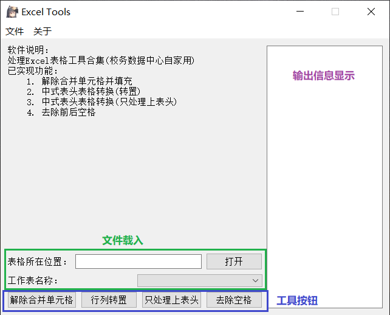
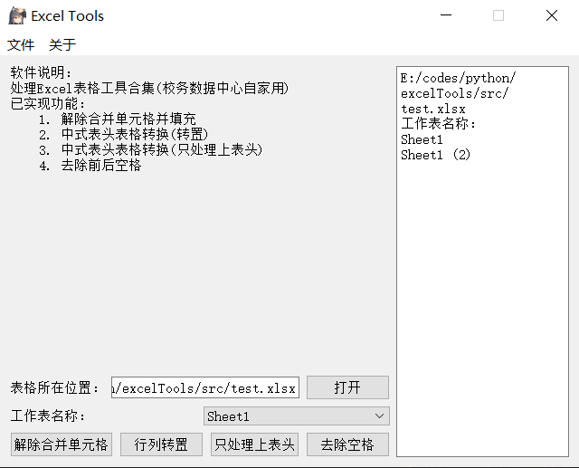
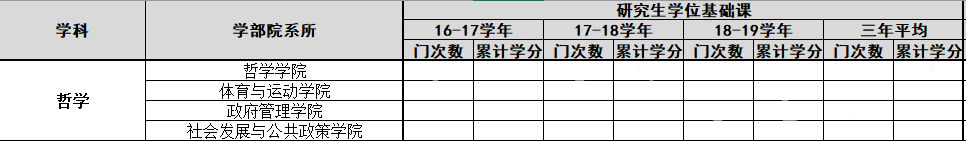
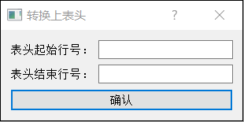
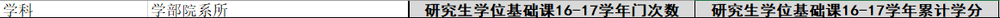
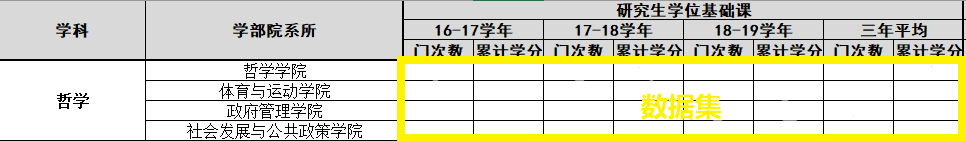
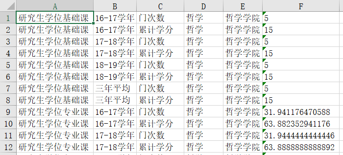
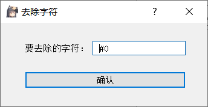
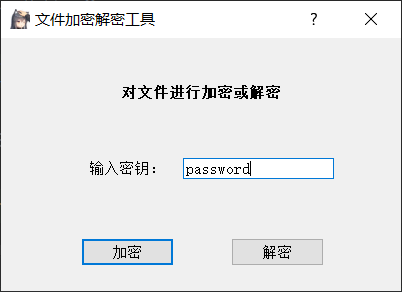
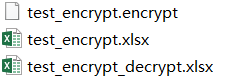

# 用Python处理Excel表格的小工具

## V3.2版本信息(2021-9-17发布)

- `Pyside2==5.15.1`
- `Python==3.7.8`
- `openpyxl==3.0.5`
- `cryptography==3.4.7`
- `pypinyin==0.41.0`
- `pyinstaller==4.0`

```
pip install Pyside2==5.15.1 openpyxl==3.0.5 cryptography==3.4.7 pypinyin==0.41.0 pyinstaller==4.0
```

## 功能介绍
1. 解除合并单元格并填充
2. 中式表头表格处理(转置)
3. 中式表头表格处理(合并上表头)
4. 去除多余字符
5. 基于SHA-256的文件加密解密
6. 表头转拼音大写首字母
7. 数值类型和日期类型数据脱敏

## 使用说明

- **主界面**



- **文件载入**



在右侧可以看到当前文件的所有工作表名称，下拉选项里可以选择工作表

- **解除合并单元格**

此工具将当前文件当前工作表所有单元格解除合并，并进行填充

- **转换上表头**

原始表格如下


输入参数：分别输入上表头的起始行号和结束行号



转换后解除所有合并单元格并填充，表头根据字段名自动拼接，合成单行表头



- **行列转置**

输入参数：分别输入数据集的起始行号、结束行号、起始列号、结束列号（列号支持输入字母）


输入如图框中的数据集的行列范围



转换后将上表头转置成列，并解除所有合并单元格并填充



- **去除多余字符**

此工具将当前文件当前工作表的所有单元格去除前后的多余字符

输入参数：要去除的多余字符，如有多种需要去除的字符，不需要分隔

下图为去除空格、井号、0



- **表头转拼音**

将中文表头转为拼音首字母大写

- **基于SHA-256的文件加解密**

对读取的文件进行加密或解密，加密和解密使用同一个界面



读取原文件，输入密钥，点击加密则生成加密文件(后缀为.encrypt)

读取加密文件(后缀为.encrypt)，输入密钥，点击解密则还原为原文件



- **数据脱敏**

对数值列、日期列进行脱敏

分别输入要脱敏的数值列号和日期列号，空格分隔


- **输出文件**

Windows系统下输出文件的位置在本程序所属文件夹内

Mac OS下输出文件位置在`home`目录

- 解除合并单元格输出文件名为`原文件名_工作表名_unmerged.xlsx`
- 行列转置输出文件名为`原文件名_工作表名(转置).xlsx`
- 处理上表头输出文件名为`原文件名_工作表名(只合并上表头).xlsx`
- 去除空格输出文件名为`原文件名_工作表名_stripped.xlsx`
- 表头转拼音输出文件名为`原文件名_工作表名_(表头转拼音).xlsx`
- 数据加密后输出文件名为`原文件名.encrypt`
- 解密后输出文件名为`源文件名_decrypt`
- 数据脱敏输出文件名为`原文件名_工作表名(数据脱敏).xlsx`

## To-Do-List
