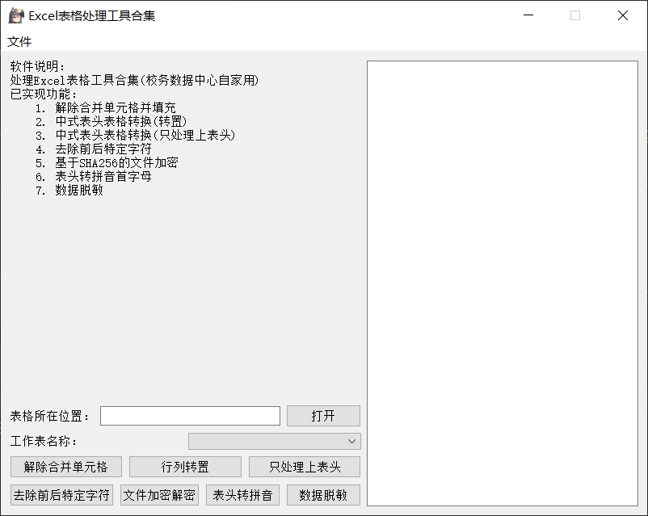
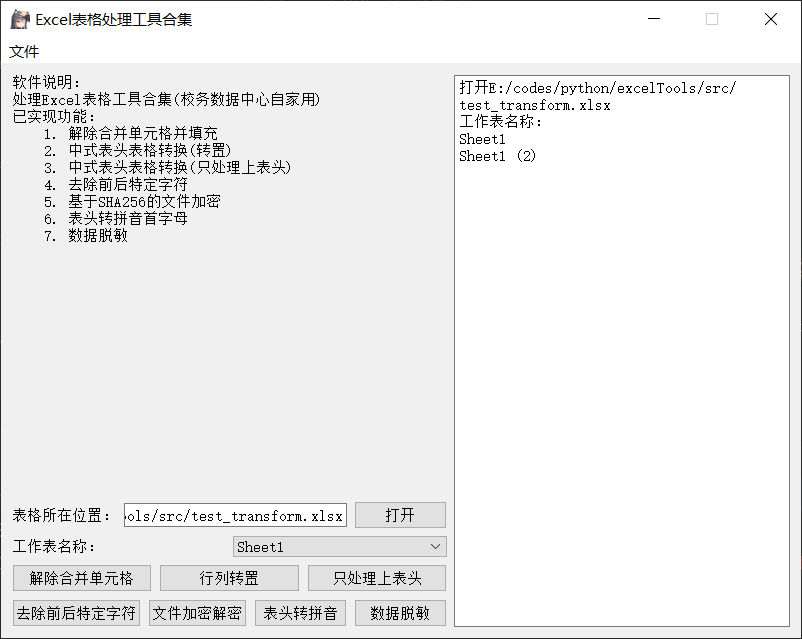
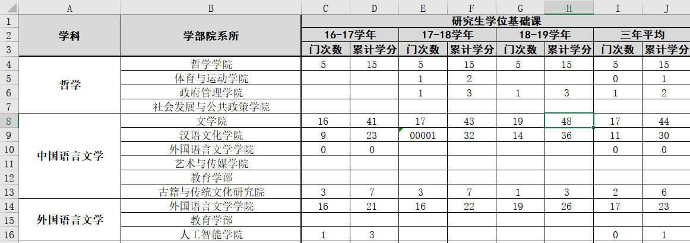
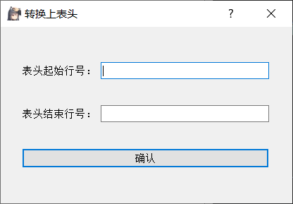
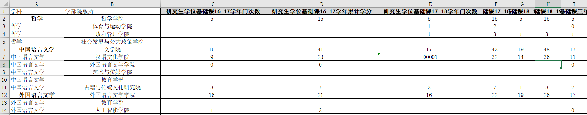
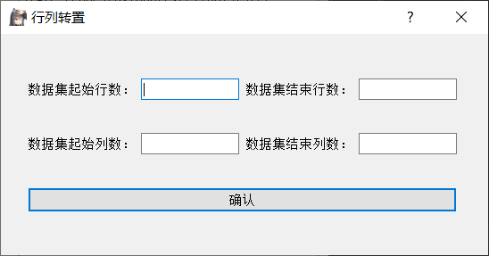
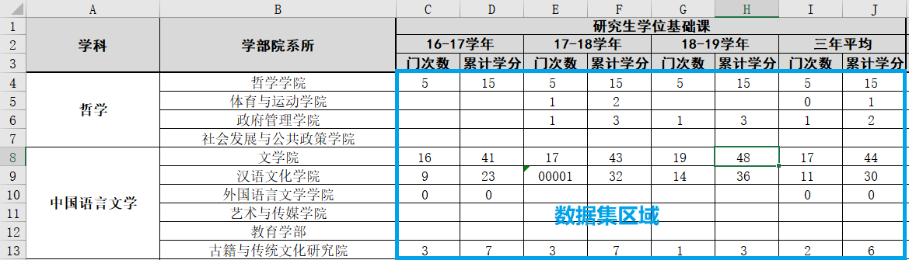

# 用Python处理Excel表格的小工具

## 版本信息(2021-2-24发布)

- `Pyside2==5.15.1`
- `Python==3.7.8`
- `openpyxl==3.0.5`
- `cryptography==3.4.7`
- `pypinyin==0.41.0`
- `pyinstaller==4.0`

```
pip install Pyside2==5.15.1 openpyxl==3.0.5 cryptography==3.4.7 pypinyin==0.41.0 pyinstaller==4.0
```

## 功能介绍
1. 解除合并单元格并填充
2. 中式表头表格处理(转置)
3. 中式表头表格处理(合并上表头)
4. 去除多于字符
5. 基于SHA-256的文件加密解密
6. 表头转拼音大写首字母
7. 数值类型和日期类型数据脱敏

## 使用说明

- **主界面**



- **文件载入**



在右侧可以看到当前文件的所有工作表名称，下拉选项里可以选择工作表

- **解除合并单元格**

此工具将当前文件当前工作表所有单元格解除合并，并进行填充

- **转换上表头**

原始表格如下


输入参数：分别输入上表头的起始行号和结束行号



转换后解除所有合并单元格并填充，表头根据字段名自动拼接，合成单行表头



- **行列转置**

输入参数：分别输入数据集的起始行号、结束行号、起始列号、结束列号（列号支持输入字母）



输入如图框中的数据集的行列范围



转换后将上表头转置成列，并解除所有合并单元格并填充


- **去除空格**

此工具将当前文件当前工作表的所有单元格去除前后空格

- **输出文件**

Windows系统下输出文件的位置在本程序所属文件夹内

Mac OS下输出文件位置在`home`目录

- 解除合并单元格输出文件名为`原文件名_工作表名_unmerged.xlsx`
- 行列转置输出文件名为`原文件名_工作表名(转置).xlsx`
- 处理上表头输出文件名为`原文件名_工作表名(只合并上表头).xlsx`
- 去除空格输出文件名为`原文件名_工作表名_stripped.xlsx`

## To-Do-List
